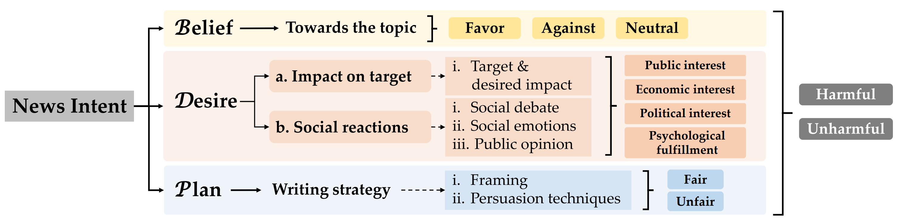
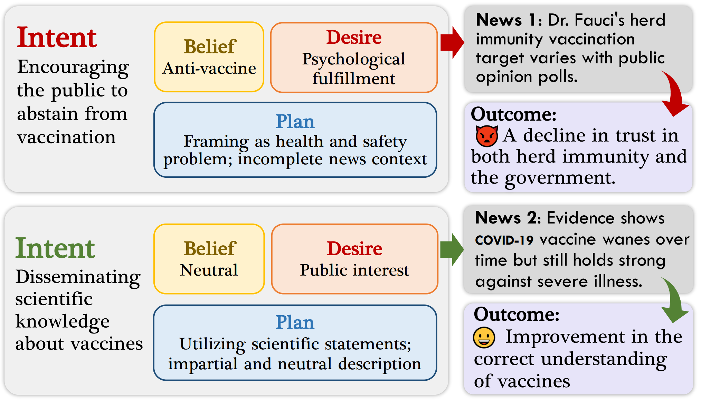
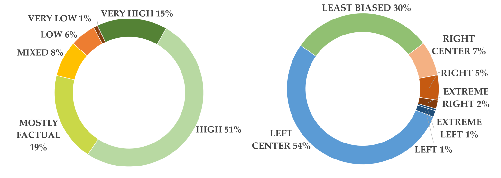
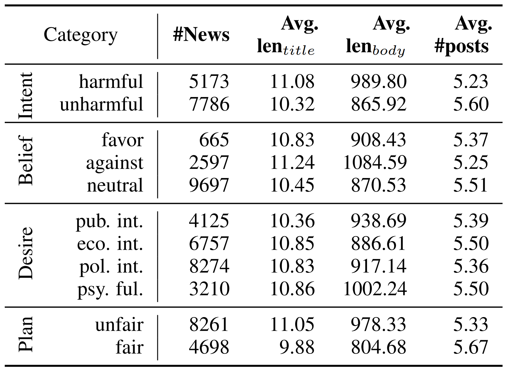

# News Creation **Intent Recognition (NewsInt)**

This repo contains the official dataset and a unified framework for news creation intent benchmarks of the research paper "**Understanding News Creation Intents: Frame, Dataset, and Method**".

## 1. Introduction

News creation intent refers to the purpose or intention behind the creation of a news article. While the significance of research on news intent has been widely acknowledged, the absence of a systematic news intent understanding framework hinders further exploration of news intent and its downstream applications. 

To bridge this gap, we propose News INTent (NINT) frame, the first component-aware formalism for understanding the news creation intent based on research in philosophy, psychology, and cognitive science. Based on the frame, we propose NewsInt, the first dataset for news creation intent understanding. This dataset encompasses a diverse range of topics and rich social context.

**To the best of our knowledge, it is the first news creation intent dataset through a deconstruction approach.**

NINT Frame for News Intent Understanding:

Examples of News Creation Intent Recognition:

## 2. Dataset Construction

The overall process of building the NewsInt dataset is shown below:

We collect raw data from 511 news domains, resulting in 12,959 news articles with an average of 5.45 discussion posts from Reddit for each news article. The obtained news articles show diverse distribution on contemporary topics (such as general politics or the US presidential race, the COVID-19 pandemic, women’s and men’s rights, climate change, vaccines, abortion, gun control, 5G, etc.).

Dataset Description:

| Field   | Example                                                      |
| ------- | ------------------------------------------------------------ |
| domain  | nytimes.com                                                  |
| date    | 2020-08-19                                                   |
| author  | Peter Eavis and Steve Lohr                                   |
| title   | Big Tech’s Domination of Business Reaches New Heights        |
| content | American tech titans flew high before the coronavirus pandemic, making billions of dollars a year. Now, the upheaval has lifted them to new heights, putting the industry in a position to dominate American business in a way unseen since the days of railroads... |

| Intent Label | Fine-grained label | domain_label     |
| ------------ | ------------------ | ---------------- |
| topic        | target             | bias_lavel       |
| belief       | target_effect      | factuality_lavel |
| desire       | rise_controversy   | satire           |
| plan         | alter_opinion      | propaganda       |
| intent       | social_emotion     | science          |
| intent_text  | frame_as           |                  |
|              | persuasion         |                  |

Dataset Distribution Based on News Domain:

Dataset Statistics:

## 3. Usage

Relevant resources will be released upon publication.
