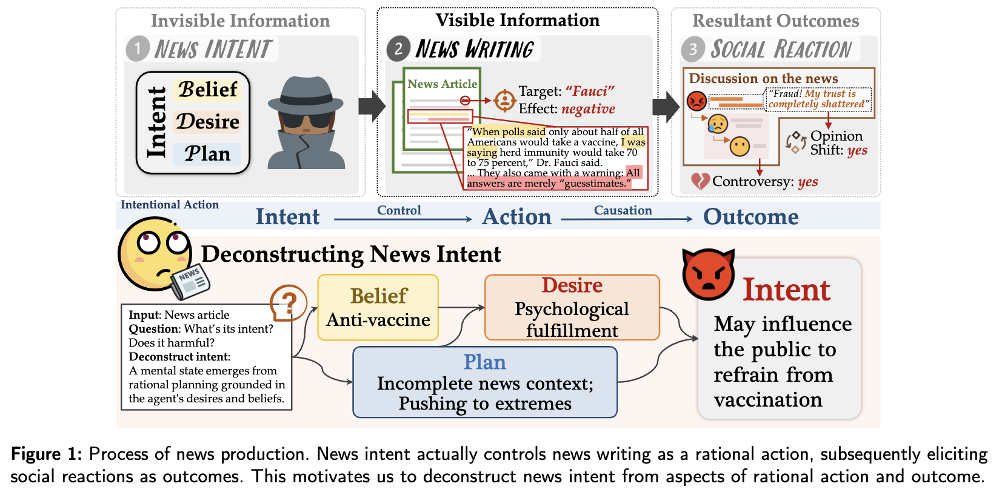
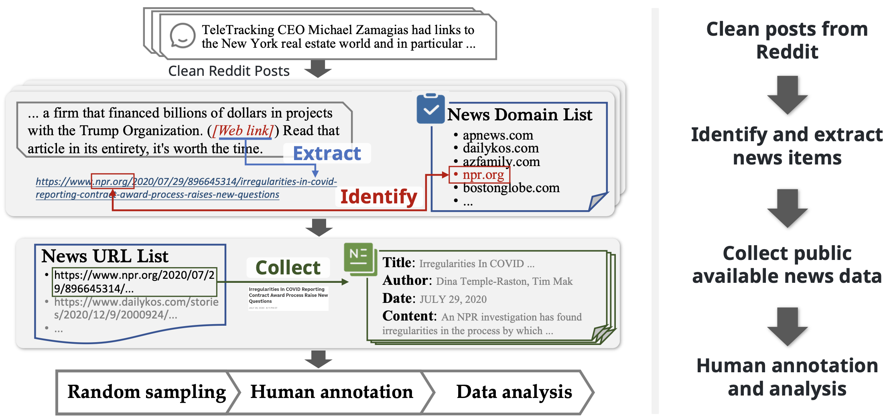
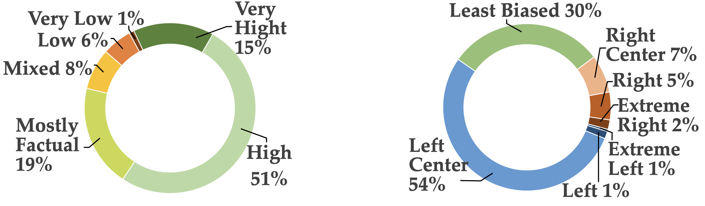
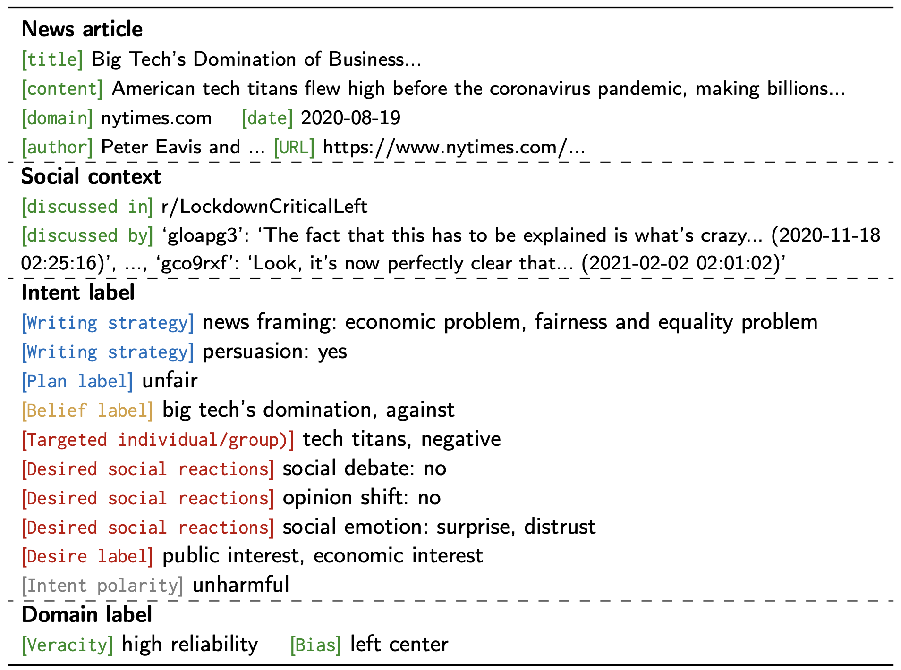

# News Creation Intent Recognition

<div align= center>

</div>

This repo contains the official dataset **NewsInt** for news intent recognition of the research paper "**Exploring news intent and its application: A theory-driven approach**" [[pdf](https://arxiv.org/pdf/2312.16490.pdf)].

📦 **NewsInt Dataset**: a fine-grained labeled dataset for news creation intent recognition

---

<!-- ⚒️ **DMInt Method**: a plug-in method for news intent application -->

```
@article{wang2023understanding,
  title={Understanding News Creation Intents: Frame, Dataset, and Method},
  author={Wang, Zhengjia and Wang, Danding and Sheng, Qiang and Cao, Juan and Su, Silong and Sun, Yifan and Hu, Beizhe and Ma, Siyuan},
  journal={arXiv preprint arXiv:2312.16490},
  year={2023}
}
```

## 1. Conceptual Deconstruction-based News INTent Understanding Framework (NINT)

<div align= center>

</div>

Intent refers to a cognitive state that emerges from rational planning, grounded in the agent's desires and beliefs. News creation intent refers to the purpose or intention behind the creation of a news article. 

We present the first **Conceptual Deconstruction-based News INTent Understanding framework (NINT)**, deconstructing news intent from perspectives of rational action and outcomes. 

NINT deconstructs the concept of news intent into beliefs, desires, and plans using interdisciplinary theories. It further situates these elements within the specific context of news to investigate the concrete manifestations of news intent.

**To the best of our knowledge, this is the first news creation intent dataset through a deconstruction approach.**


## 2. Dataset Construction

The overall process of building the NewsInt dataset is shown below:

<div align= center>

</div>

We collect raw data from 511 news domains, resulting in 12,959 news articles with an average of 5.45 discussion posts from Reddit for each news article. The obtained news articles show diverse distribution on contemporary topics (such as general politics or the US presidential race, the COVID-19 pandemic, women’s and men’s rights, climate change, vaccines, abortion, gun control, 5G, etc.).


Data distribution in factuality (left) and political bias level (right):

<div align= center>

</div>

An Instance from the NewsInt dataset:

<div align= center>

</div>

For more details on data collection, annotation, and dataset analysis, please refer to our original paper "**Exploring news intent and its application: A theory-driven approach**".

## 3. Usage

Please fill out this form: [Application to Use the Dataset NewsInt](https://forms.office.com/r/9QvFCFT835) to request access.

