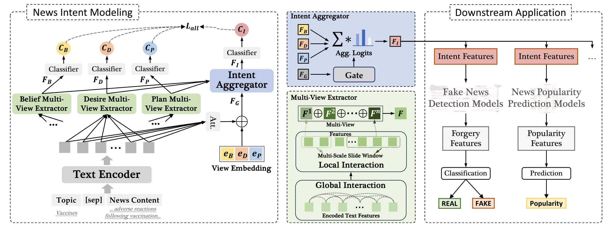

# 🗞️ DMint Model

Deconstruction-based Multi-view News INTent Modeling (**DMint**) model is released as part of the paper: **"Exploring news intent and its application: A theory-driven approach"**  
Published in *Information Processing & Management*, 2025.  

- 🛠️ Project: https://github.com/ICTMCG/NewsInt
- 🔗 Paper: https://doi.org/10.1016/j.ipm.2025.104229
- 🏡 Home page: https://zhengjiawa.github.io/

---

# 📦 File Structure

```
📦DMint
 ┣ 📂models
 ┃ ┣ 📜dmint.py
 ┃ ┗ 📜layers.py
 ┣ 📂utils
 ┃ ┣ 📜dataset.py
 ┃ ┣ 📜misc.py
 ┃ ┗ 📜utils.py
 ┣ 📜engine.py
 ┣ 📜grid_search.py
 ┣ 📜main.py
 ┣ 📜run.sh
 ┗ 📜run_infer.sh
 ```

## 📰 Model Architecture

<div align= center>

</div>

DMint introduces a cognitive-inspired architecture that decomposes news intent through multi-view
extractors and dynamic view-gated aggregation, enabling joint modeling of compositional semantics and contextual writing patterns via local–global interactions.

- `Text encoder`: Given the news topic and news content, we concatenate them using the [𝑠𝑒𝑝] token as input. Specifically, RoBERTa (Liu et al., 2019) is employed as the text encoder.
- `Multi-View Extractor`: Three multi-view extractors are developed to explicitly capture different dimensions of news intent.
- `Intent Aggregator`: builds an adaptive approach, allowing the proposed DMint to adjust and combine these representations (of elements of news intent) dynamically.


## 🚀 Usage

Commands for training and inference have been written in the following bash file. Run by:

```
bash run.sh
bash run_infer.sh
```

Results will be automatically saved in `./param_model/`

Suggested requirements:
```
numpy==2.3.5
scikit_learn==1.7.2
torch==2.5.1+cu121
torchvision==0.20.1+cu121
transformers==4.45.2
```

# 📖 Citation
If you find this repository useful, please cite our paper:

```
@article{wang2025exploring,
  title = {Exploring news intent and its application: A theory-driven approach},
  author = {Wang, Zhengjia and Wang, Danding and Sheng, Qiang and Cao, Juan and Ma, Siyuan and Cheng, Haonan},
  journal = {Information Processing \& Management},
  volume = {62},
  number = {6},
  pages = {104229},
  year = {2025},
  publisher = {Elsevier},
  issn = {0306-4573},
  doi = {https://doi.org/10.1016/j.ipm.2025.104229},
  url = {https://www.sciencedirect.com/science/article/pii/S0306457325001700}
}
```
